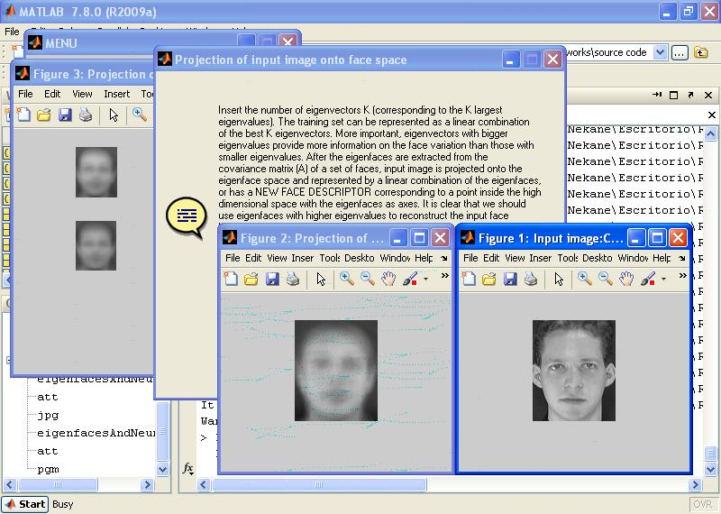

# facerecognition

PCA and Neural Networks applied to face recognition

Face recognition system is based on principal component analysis and neural network. The system functions by projecting face images onto a feature space that spans the significant variations among known face images (see image). The significant features are known as "eigenfaces" because they are the eigenvectors (principal components) of the set of faces. The number of eigenvectors K (corresponding to the K largest eigenvalues). The training set can be represented as a linear combination of the best K eigenvectors. More important, eigenvectors with bigger eigenvalues provide more information on the face variation than those with smaller eigenvalues. After the eigenfaces are extracted from the covariance matrix (A) of a set of faces, input image is projected onto the EIGENFACE SPACE and represented by a linear combination of the eigenfaces, or has a NEW FACE DESCRIPTOR corresponding to a point inside the high dimensional space with the eigenfaces as axes. It is clear that we should use eigenfaces with higher eigenvalues to reconstruct the input face because they provide much more information on the face variation. We use the K eigenfaces with the highest eigenvalues. The face which we try to recognize is projected onto the K eigenfaces first. It produces a new description of the face with only K real numbers. One approach to find the face pattern is to calculate the Euclidean distance between the input face descriptor and each known face model in the database. All faces of the same individual are supposed to be closed to each other while different persons have different face clusters. But actually we do not have any prior knowledge on the distribution of the new face descriptors. They have found that usage of this method is not sufficient in real tests. A good approach is to recognize the face in unsupervised manner using neural network architecture. The NEURAL NETWORK has a general structure with three layers. The input layer has K nodes from the new face descriptors. The hidden layer has H nodes. The output unit gives a result from 0.0 to 1.0 telling how much the input face can be thought as the network host. In order to make the TRAINING of neural network easier, one output neural is created for each person. Neural net identifies whether the input face is the network host or not. The recognition algorithm selects the output neuron network with the MAXIMUM OUTPUT.

NOTE: Copy all files in Matlab current directory and type "eigenfacesAndNeuralNetworks" on Matlab command window.

